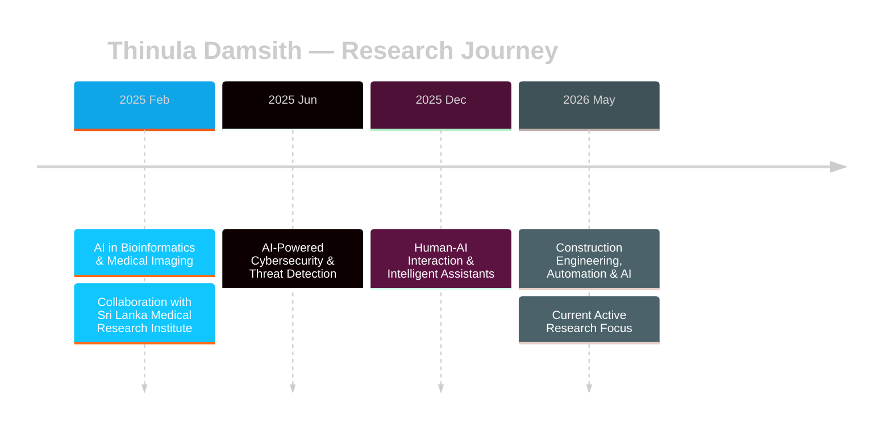

<div align="center">

<!-- Animated Header -->


<!-- Animated Typing SVG -->
<a href="https://git.io/typing-svg">
  
</a>

<br/>

<p>
  
  
  
</p>

<p>
  <a href="https://www.thinuladamsith.com">
    
  </a>
  &nbsp;
  <a href="https://www.linkedin.com/in/thinula-damsith">
    
  </a>
  &nbsp;
  <a href="mailto:contact.thinuladamsith@gmail.com">
    
  </a>
</p>

</div>

---


##  &nbsp; About Me


```yaml
Name:        Thinula Damsith
Role:        AI Engineer & Data Scientist
Degree:      BSc (Hons) Data Science
             University of Plymouth
             Upper Second Class Honours
Location:    Sri Lanka 🇱🇰

Interests:   Medical & bioinformatics AI
             AI-driven cybersecurity
             Human-AI interaction
             Automation for engineering

Approach:    Research-led engineering
             Security-first architecture
             Shipping production systems
```

> *"Dream beyond boundaries. Build beyond imagination. Lead beyond expectation."*

<br clear="right"/>

---

##  &nbsp; Research Timeline




##  &nbsp; Featured Projects

<div align="center">

<table>
<tr>
<td width="33%" align="center" valign="top">

### 🧬 GammaMed AI
**Medical Intelligence Platform**

AI-powered disease detection and diagnostics using bioinformatics, NLP, and real-time inference.

<br/>


</td>
<td width="33%" align="center" valign="top">

### 🩸 DonorsBridge
**Global Donation Ecosystem**

Organ, blood & hair donation platform with AI matching, KYC identity verification, and real-time communication layers.

<br/>


</td>
<td width="33%" align="center" valign="top">

### 🖥️ InfinityOS
**Unified Digital Operating System**

Modular OS for distributed organizations built around five specialized layers.

<br/>


</td>
</tr>
</table>

</div>


##  &nbsp; Research Portfolio

<details open>
<summary><b>🏗️ &nbsp; Construction Engineering, Automation & AI &nbsp; </b></summary>

<br/>

Advancing AI-assisted infrastructure intelligence and automation workflows to improve productivity, safety, planning quality, and decision-making across construction ecosystems.

| Direction | Focus |
|---|---|
| 🔭 Predictive Monitoring | Data-driven operational planning and real-time site intelligence |
| 👁️ Computer Vision | AI-assisted and CV-supported construction monitoring |
| ⚙️ Workflow Automation | Modern construction ecosystem process automation |
| 📈 Digital Transformation | Scalable strategies for engineering operations |

<br/>

</details>

<details>
<summary><b>🤖 &nbsp; Human-AI Interaction & Intelligent Assistants &nbsp; </b></summary>

<br/>

Researched human-centered AI assistant systems emphasizing contextual understanding, productivity enhancement, conversational intelligence, and collaborative automation.

| Direction | Focus |
|---|---|
| 💬 Conversational AI | Contextual assistant models and NLP systems |
| 🎯 Adaptive UX | Intelligent tooling with adaptive user experiences |
| 🧠 Decision Support | AI-assisted decision-support systems |
| 🔄 Productivity Workflows | Scalable human-AI collaboration frameworks |

<br/>

</details>

<details>
<summary><b>🔐 &nbsp; AI-Powered Cybersecurity & Threat Detection &nbsp; </b></summary>

<br/>

Conducted research on intelligent threat detection frameworks using AI and analytical models for anomaly identification, fraud prevention, and automated cybersecurity operations.

| Direction | Focus |
|---|---|
| 🚨 Anomaly Detection | Real-time intrusion and anomaly identification |
| 🧩 Threat Intelligence | Behavioral and predictive risk assessment |
| 🔍 Security Monitoring | Data-driven response automation |
| 🏢 Enterprise Architecture | Scalable cybersecurity infrastructure design |

<br/>

</details>

<details>
<summary><b>🧬 &nbsp; AI Research in Bioinformatics & Medical Imaging &nbsp; </b></summary>

<br/>

> *In collaboration with the Sri Lanka Medical Research Institute*

Worked on healthcare-focused AI systems for medical image interpretation, pattern recognition, and machine learning-driven diagnostic support.

| Direction | Focus |
|---|---|
| 🖼️ Medical Imaging | AI and computer vision for image analysis |
| 🔬 Pattern Recognition | Clinical intelligence and diagnostic support |
| 🧪 Bioinformatics | Data analysis and biological interpretation |
| 💊 Decision Support | Healthcare environment advisory systems |

<br/>

</details>


##  &nbsp; Technical Ecosystem

<div align="center">

### Core & Languages


### Frameworks & Backend


### Data, Cloud & Infrastructure


### AI & Intelligence

&nbsp;


### Security & Governance
<p>
  
  
  
  
</p>

</div>


##  &nbsp; GitHub Analytics

<div align="center">

<br/>


<br/><br/>


</div>


##  &nbsp; Current Focus

<div align="center">

| 🎯 Area | 🔬 What I'm Building |
|---|---|
| 🔐 **Secure AI Architecture** | Compliance-sensitive systems for regulated industries |
| ⚙️ **Intelligent Automation** | Workflow automation platforms at scale |
| 🏗️ **Smart Engineering** | AI-native infrastructure for construction ecosystems |
| 🧬 **Medical AI** | Diagnostic support and bioinformatics research |

</div>

---

##  &nbsp; Let's Connect

<div align="center">

```
╔══════════════════════════════════════════════════════════════════╗
║                                                                  ║
║   "Dream beyond boundaries.                                      ║
║    Build beyond imagination.                                     ║
║    Lead beyond expectation."                                     ║
║                                                                  ║
║   ── Thinula Damsith                                             ║
╚══════════════════════════════════════════════════════════════════╝
```

**Research collaboration** &nbsp;·&nbsp; **AI & security projects** &nbsp;·&nbsp; **Open-source contributions**

<br/>

<a href="https://www.thinuladamsith.com">
  
</a>
&nbsp;
<a href="https://www.linkedin.com/in/thinula-damsith">
  
</a>
&nbsp;
<a href="mailto:contact.thinuladamsith@gmail.com">
  
</a>

<br/>

<!-- Snake Animation -->


**If you're building something ambitious — let's connect and create it with purpose.**

</div>

<!-- Animated Footer -->

